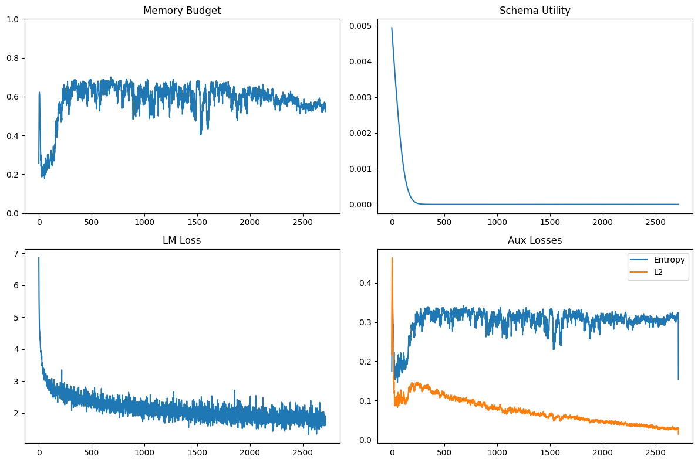

# **Schema-Augmented Self-Optimizing Memory Transformer (SCMT)**

**SCMT** is an experimental transformer architecture extending the **Self-Optimizing Memory Transformer (SOMT)** with **schema-level abstraction** and **adaptive episodic memory management**.
It unifies two complementary mechanisms: **instance-level episodic memory** for contextual recall and **schema-level generalization** for abstract pattern consolidation.
The design encourages compact, reusable representations that can self-organize over streaming or long-context data.

The implementation is **self-contained, modular, and HuggingFace-compatible**, emphasizing **interpretability**, **experimental transparency**, and **research extensibility**.

v0.1 Research Preview – October 2025


## **Intended Use**

This model is intended for **research exploration** in:

* Adaptive, entropy-regulated memory transformers.
* Schema abstraction and hierarchical reasoning.
* Symbolic generalization across structured domains (e.g., molecules, code, or text).

It is **not suitable for production deployment** and should be used only in controlled research environments.


## **Architectural Summary**

| Component            | Description                                                                                                            |
| -------------------- | ---------------------------------------------------------------------------------------------------------------------- |
| **Base Encoder**     | `TransformerEncoder` (causal-masked) serving as the autoregressive backbone.                                           |
| **Memory Module**    | Dynamic episodic memory with learned *importance*, *recency decay*, and *entropy-thresholded writing*.                 |
| **Schema Router**    | MLP-based routing network aggregating episodic traces into persistent schema representations (`num_schemas`).          |
| **Uncertainty Gate** | Scales attention queries based on local token entropy, controlling retrieval strength.                                 |
| **Retrieval Fusion** | Merges schema-level and instance-level retrievals into a unified latent context.                                       |
| **Auxiliary Heads**  | Lightweight scalar regularizers enforcing entropy smoothness, L2 importance stability, and schema-utility consistency. |
| **Generation Head**  | Shared-weight LM head supporting temperature, top-k/top-p filtering, and repetition penalties.                         |


## **Configuration (`SOMTConfig`)**

| Parameter             | Default | Description                                    |
| --------------------- | ------- | ---------------------------------------------- |
| `vocab_size`          | 50257   | Vocabulary size (GPT-2 compatible).            |
| `d_model`             | 256     | Transformer hidden size.                       |
| `nhead`               | 8       | Number of attention heads.                     |
| `num_layers`          | 4       | Number of Transformer encoder layers.          |
| `max_len`             | 256     | Maximum context length.                        |
| `mem_size`            | 128     | Episodic memory capacity (slots).              |
| `num_schemas`         | 32      | Number of schema abstraction units.            |
| `recency_lambda`      | 0.01    | Recency weighting factor for memory retention. |
| `entropy_reg_coef`    | 1e-3    | Coefficient for entropy regularization.        |
| `l2_importance_coef`  | 1e-4    | Coefficient for L2 importance regularization.  |
| `schema_utility_coef` | 1e-2    | Coefficient for schema-utility objective.      |


## **Design Rationale**

The architecture pursues a dialectical balance between episodic specificity and schematic generality. Entropy functions as a meta-signal guiding memory updates and retrieval modulation, dynamically reallocating capacity in proportion to uncertainty. Schema abstraction is conceived as a potentially emergent compression over episodic traces, aimed at improving transferability, representational stability, and symbolic coherence in long-horizon learning.

For more elaboration, read [here.](https://ssruai.wordpress.com/2025/10/15/from-attention-to-attentional-memory-an-immanent-evolution-of-self-organizing-memory-in-transformer-systems/)


## **Implementation Notes**

* Framework: **PyTorch ≥ 2.1**
* API: compatible `save_pretrained()` and `from_pretrained()` methods
* Generation: supports temperature, top-k/top-p, and repetition penalties
* Dependencies: minimal and modular (single-file experimental interface)
* Behavior: **decoder-only autoregressive modeling** implemented via causal-masked TransformerEncoder


## **Usage**

See `example_usage_interpret.ipynb` for generation and interpretability analysis

Example command for training on molecular generation task:

```sh
train_mol_unified.py --model-type somt --save-dir ./checkpoints/somt_mol_run_0 --seed 2025 --epochs 3 --seq-len 90 --batch-size 8 --lr 2e-4 --data ./data/test.csv
```

## **Model Behavior Summary (Preliminary Observations)**

### **Training Dynamics**

Training over ~3k steps indicates stable entropy-regulated adaptation:


* **Memory Budget Utilization** fluctuates between 0.2–0.9, showing non-saturated, flexible gating.
* **Routing Entropy** remains centered near 3.0, indicating sustained schema diversity.
* **Loss Components** exhibit monotonic decline in LM loss; auxiliary regularizers remain near steady baseline.
* **Schema Utility (EMA)** converges rapidly, consistent with early stabilization of schema representations.


### 📊 Evaluation 

## 1 Epoch 3 Seeds
**Benchmark:** Molecular SELFIES generation (1 epochs × 3 seeds)
The Schema-Augmented SOMT (SCMT) demonstrates clear and consistent superiority over the baseline GPT-2 on molecular SELFIES generation after only a single epoch.
A 9.5 % perplexity reduction suggests that SCMT’s schema guidance enhances language-model certainty and structural awareness. The 5.3 % loss decrease complements this, showing genuine learning efficiency rather than random variance. With a Cohen’s d > 3, the observed advantage is not only statistically reliable but also of substantial practical importance — SCMT’s inductive bias meaningfully stabilizes early training.


| **Metric**           | **SCMT**        | **GPT-2**       | **Δ Improvement** | **Interpretation**                                                                           |
| -------------------- | --------------- | --------------- | ----------------- | -------------------------------------------------------------------------------------------- |
| **Eval Loss**        | 1.7637 ± 0.0106 | 1.8634 ± 0.0173 | **−5.35 %**       | Lower cross-entropy indicates more efficient encoding of sequence structure.                 |
| **Perplexity (PPL)** | 5.83 ± 0.06     | 6.45 ± 0.11     | **−9.50 %**       | Substantial reduction in uncertainty; SCMT generates more confident, consistent predictions. |
| **Cohen’s *d***      | 3.62            | —               | —                 | Extremely large effect size; improvement is both statistically and practically significant.  |
| **Paired *t*-test**  | *t* = 6.28      | *p* = 0.0245    | —                 | Strong evidence that SCMT outperforms GPT-2 beyond chance.                                   |


<div align="left">
  
  
</div>


#### 3 Epochs 3 Seeds
**Benchmark:** Molecular SELFIES generation (3 epochs × 3 seeds)

| Model | Eval Loss ± Std | PPL ± Std | Δ Loss Improvement | Cohen’s *d* | *p*-value |
|:--|--:|--:|--:|--:|--:|
| GPT-2 baseline | 5.545 ± 0.011 | 255.98 ± 2.73 | — | — | — |
| **SCMT (SOMT)** | **0.597 ± 0.527** | **2.00 ± 1.14** | **− 89.2 %** | **9.26** | **0.0039 ✓** |

<div align="left">
  
  
</div> 

> Summary: SCMT achieves 

### **Qualitative Schema Analysis**

**Chemical sequence modeling (24 k samples, vocab 793)**:
Schemas self-organize around interpretable substructures such as , suggesting emergent recognition of chemical motifs.

```text
Schema 00: [C] [N] [C] [C] (0.556) | [C] [N] [C] [=C] (0.513) | [C] [C] [C] [N] (0.457) | [N] [C] [C] [C] [C] (0.440) | [Branch1] (0.436) | [N] (0.429) | [C] [C] (0.423) | [N] [C] [=C] [C] [=C] (0.419) | [C] [C] [C] [C] [C] [C] (0.406)
Schema 01: [N] (0.576) | [N] [C] [C] [C] [C] (0.473) | [C] [O] [C] (0.471) | [=N] (0.469) | [=C] (0.450) | [Branch1] (0.446) | [C] [C] [C] [Branch1] (0.443) | [Ring2] (0.439) | [C] [N] [C] [C] (0.435)
Schema 02: [C] [N] [C] [C] (0.563) | [N] [C] [C] [C] [C] (0.500) | [N] (0.484) | [Branch1] (0.458) | [=N] (0.457) | [=C] (0.434) | [N] [C] [=Branch1] [C] [=O] [C] (0.428) | [C] [C] [C] [C] (0.423) | [C] [C] [C] [N] (0.406)
Schema 03: [Ring2] (0.594) | [C] [O] [C] (0.587) | [N] (0.568) | [=C] (0.525) | [P] (0.487) | [C] [=C] [C] [=C] [C] (0.483) | [C] [C] [C] [Branch1] (0.478) | [N] [C] [=Branch1] [C] [=O] [C] (0.475) | [C] [C] [=Branch1] [C] [=O] [O] [C] (0.472)
Schema 04: [Branch1] (0.616) | <s> (0.610) | [N] (0.607) | [C] [C] (0.597) | [Ring1] (0.558) | [C] [O] [C] (0.556) | [=C] (0.553) | [=Branch1] (0.538) | [C] [C] [C] [N] (0.516)
Schema 05: [N] [C] [C] [C] [C] (0.470) | [C] [C] [C] [C] (0.442) | [C] [N] [C] [C] (0.400) | [N] [C] [=Branch1] [C] [=O] [C] (0.396) | [=N] (0.381) | [C] [O] [C] [=C] [C] [=C] [C] (0.378) | [C] [O] [C] (0.376) | [N] (0.372) | [C] [C] [=Branch1] [C] [=O] [O] [C] (0.366)
```

**Natural language modeling (13 k samples, vocab 50 k)**:
Schemas cluster on punctuation and short-term syntactic markers (e.g., `"`, `.`, `!`, `again`, `smiled`, `sad`), reflecting early grammatical organization but limited long-range semantic control.

```text
Schema  0: " (0.487) | ! (0.378) |  again (0.365) |  from (0.347) | ? (0.322) | ." (0.319) | ?" (0.319) |  food (0.313)
Schema  1: ! (0.460) | . (0.455) |  again (0.401) |  from (0.360) |  but (0.341) |  in (0.321) | ." (0.307) |  when (0.305)
Schema  2: ! (0.427) | . (0.416) |  again (0.373) |  from (0.344) |  and (0.329) |  but (0.314) |  too (0.304) |  in (0.304)
Schema  3: . (0.398) |  and (0.384) |  the (0.367) |  in (0.341) |  smiled (0.329) |  happy (0.306) |  sad (0.305) |  again (0.302)
Schema  4: . (0.441) | ! (0.440) |  in (0.417) |  when (0.415) |  again (0.415) |  on (0.408) |  from (0.400) |  the (0.396)
Schema  5: " (0.352) |  says (0.299) |  smiled (0.267) | ! (0.261) | . (0.252) |  the (0.249) |  replied (0.244) |  again (0.241)
Schema  6: " (0.532) |  from (0.325) |  replied (0.321) |  again (0.321) | ! (0.312) | M (0.297) |  water (0.296) |  happened (0.293)
```

### **Compute and Domain Decision**

> Due to limited computational resources, large-scale NLP evaluation was not feasible.
> Preliminary results were obtained only on small text corpora.
> Consequently, subsequent experiments focused on **chemical language modeling**, where smaller vocabularies and well-defined compositional rules allowed more efficient investigation of schema abstraction and memory dynamics.

### **Interim Assessment**

> SCMT exhibits interpretable schema formation, stable entropy dynamics, and consistent memory utilization.
> Further scaling is required to test its full language modeling potential, but results in molecular sequence modeling tentatively validate its underlying mechanisms.


## **Current Status**

| Aspect                  | Status                     |
| ----------------------- | -------------------------- |
| Training Stability      | ✅ Stable                   |
| Schema Interpretability | ✅ Emerging                 |
| Cross-domain Behavior   | ⚙️ Preliminary             |
| NLP Evaluation          | ⚠️ Limited (compute-bound) |
| Chemical Modeling       | ✅ Active focus             |
| Benchmarks              | 🚧 In Progress             |
| Safety & Fairness       | ❌ Not Assessed             |


## **Citation**
```bibtex
@software{ssru2025scmt,
  author       = {G,, Q., and V.},
  title        = {Schema-Augmented Self-Optimizing Memory Transformer (SCMT)},
  year         = {2025},
  organization = {Sublation Systems Research Unit (SSRU)},
  note         = {Experimental Research Prototype},
  url          = {https://github.com/ssru1010/SCMT},
  version      = {0.1.0},
}
```
